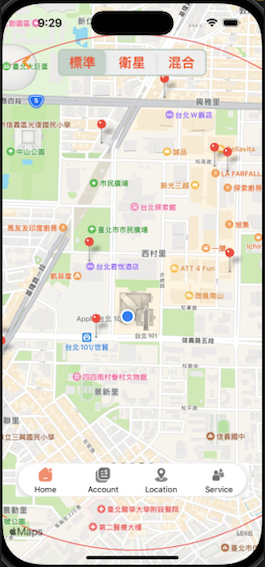

# HotelhouseV2
hotelhouse-V2，為資策會結業作品「寶島旅社」的升級版\
補齊前版不足處，並嘗試使用實務所學經驗，加以應用

- 套件使用 SPM 安裝

# 資料來源
- 旅店資料來源與前版相同，使用 [政府公開平台 - 旅館民宿-觀光資訊資料庫](https://data.gov.tw/dataset/7780) API 串接。
>fix: 因於 2023-06-16 18:10 資料庫更新異動後，架構與舊版差異極大，APP API 無法解析成功，且必須申請權限才可使用\
>避免影響 App 使用，先暫時存於 APP 內以 .JSON 檔案，來做使用。
- gif 動圖檔案，目前為學術研究示意使用
>TODO: 替換 git 檔，避免侵權

# 首頁 (FrontPageViewController)
tableView 為底層使用，搭配 cell 顯示對應 UI\
loading cell 使用 Skeleton Screen

上方為客製 navigation 功能區，
- 開啟/關閉 搜尋 view
- 進入 map 搜尋模式

## 旅店介紹頁 (HotelDetailViewController)
tableView 為底層使用，搭配 cell 顯示對應 UI\
cell 主要有 5 個，以 enum HotelDetailType 來做區分使用
hotelMap cell 可以點選，進入 HotelDetailMapViewController 頁查詢旅店位置
```swift
enum HotelDetailType: Int {
    case hotelImage = 0
    case hotelDetails
    case hotelDescription
    case hotelExtra
    case hotelMap
}
```
## 地圖搜尋頁 (MapSearchViewController)
- 抓取 user 定位後，使用 circleOverlay 展示紅圈\
並僅顯示紅圈範圍內的旅店。
- 使用 touch Callout 面板，點選進入 HotelDetailViewController 頁

>TODO: 整合 HotelDetailMapViewController 與 MapSearchViewController ，共用同一頁的 map 就好，並增加客製化的 TabBar 以按鈕來做切換使用

- 預期的 UI 效果



# 收藏 (CollectionsViewController)
- use 點選 收藏按鈕，將立即把該筆 hotel 資料存至 Realm 中\
(目前於首頁、資料細節頁，都有做收藏鈕)

- 新增資料至 Realm 的 func\
```swift
func addHotelDataModelToRealm(_ hotelDataModel: Hotels)
```
存入前，會同步檢查該筆資料，是否已建立過

- 將資料從 Realm 中取出
```swift
func getHotelDataModelsFromRealm() -> [Hotels] 
```
目前依照 city 來給予 section title 區分\
使用 UISegmentedControl 來區分列表、地圖模式
```swift
private let segmentedControl: UISegmentedControl
```

>TODO: 
>- 1.cell UI 部分還在規劃要怎麼設計
>- 2.地圖模式中，顯示已收藏的旅店標記起來，並於下方使用 collectionView
>- 3.比對是否已建立，更換不同的 收藏按鈕 icon

參考 [Figma 目前規劃的 UI](https://www.figma.com/file/MzcYqkwJp73iKYaGdMg0OH/Untitled?type=design&node-id=0-1&mode=design&t=9t8MSUnldDL7BGXL-0)